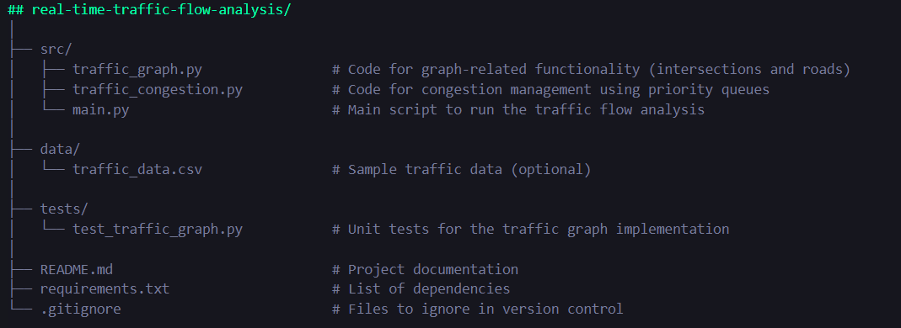

## Real-time Traffic Flow Analysis (Stack)
This project simulates real-time traffic flow analysis using graphs and priority queues. It aims to analyze and manage traffic congestion through effective data structures, representing intersections and roads as graphs, and utilizing heaps for managing congested routes.

## Features:
Graph Representation: Roads and intersections are modeled as a graph to visualize the traffic network.
Congestion Management: Roads are processed based on congestion levels using a priority queue, allowing for efficient traffic flow management.
Project Structure:

## real-time-traffic-flow-analysis/


## How to Run the Project:
Clone the Repository: Open your terminal (command prompt) and run the following command to clone the repository:
git clone https://github.com/your-username/real-time-traffic-flow-analysis.git
Replace your-username with your actual GitHub username.

Navigate to the Project Directory: Change into the project directory:

bash
cd real-time-traffic-flow-analysis
Install Dependencies: Make sure you have Python and pip installed. Then install the required dependencies by running:

```bash
pip install -r requirements.txt
Run the Project: Execute the main script to start the traffic flow analysis:

python src/main.py
View Results: The output will display the processed roads and their congestion levels based on your implemented logic.

Run Tests (Optional): To ensure that everything is working correctly, you can run the unit tests by executing:
python -m unittest discover tests
```
**Contributing:**
Contributions are welcome! If you have suggestions or improvements, please fork the repository and submit a pull request.